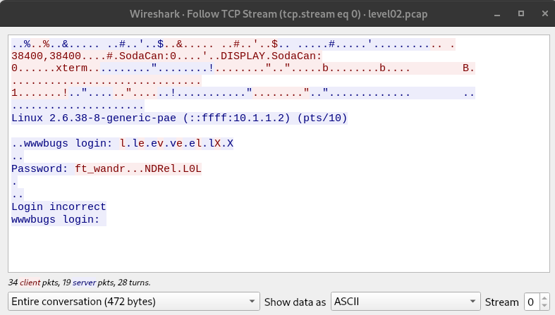
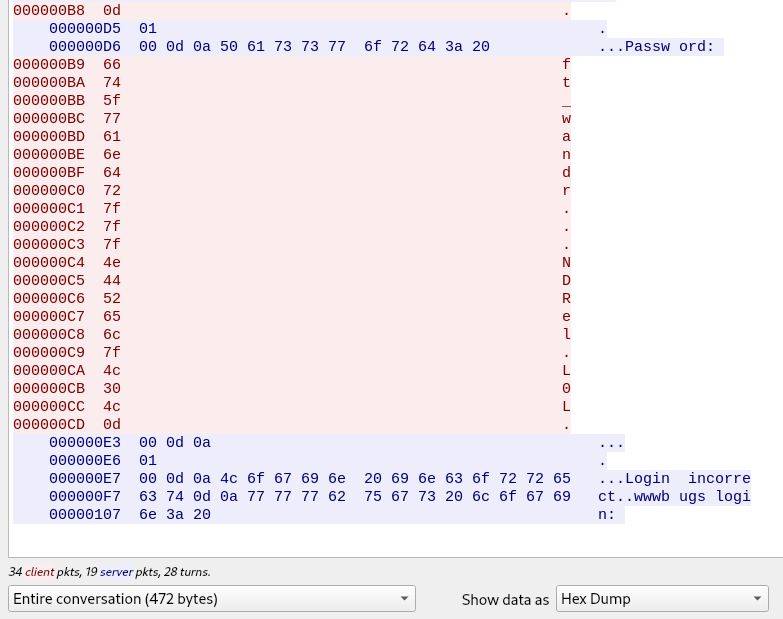

# level02

## login with user "level02"
Found a file "level02.pcap" in home dir.

## GIYF
Found two tools that can read .pcap files:
1. tcpdump  
A CLI tool to read .pcap file:
`tcpdump -tnr pcapfile.pcap`
The output didn't gave much information. Even if we use other options like `tcpdump -qns 0 -X -r pcapfile.pcap` to print out the payload. It's still not very easy to find the information we want.

2. wireshark  
A GUI tool. Easier to use.  
- File -> open (open the level02.pcap file)
- Analyze -> Follow -> TCP Stream

Got a string after the "Password" prompt "ft_wandr...NDRel.L0L"
But this is not the right password.
- Show data as "Hex Dump"(in the dropdown menu below the payload section)

- This shows the ASCII hex code for each char. The code of the dots are "7f" whitch is the DEL key.
- So the string is actually "ft_wandr{DEL}{DEL}{DEL}NDRel[DEL]L0L" -> "ft_waNDReL0L"

## Takeaway
- Packet capture  
- Usage of tcpdump and wireshark to read packet data.  
- ASCII code
